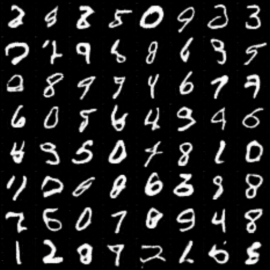
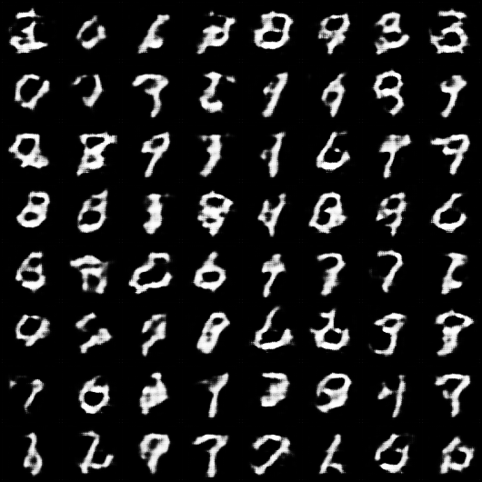
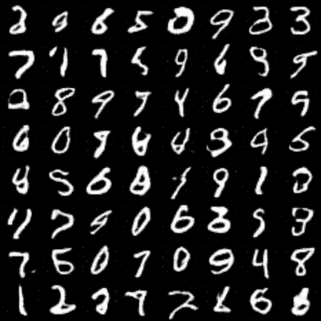

# DCGAN Implementation in PyTorch


A faithful from-scratch implementation of the Deep Convolutional Generative Adversarial Network (DCGAN) architecture in PyTorch, trained on the MNIST dataset.


*<p align="center">Sample of digits generated by the model after 10 epochs.</p>*

## Table of Contents
- [Introduction](#introduction)
- [Key Concepts](#key-concepts)
- [Project Structure](#project-structure)
- [Model Architecture](#model-architecture)
- [Dataset](#dataset)
- [Setup and Installation](#setup-and-installation)
- [How to Run](#how-to-run)
- [Results and Analysis](#results-and-analysis)
- [Future Improvements](#future-improvements)
- [License](#license)
- [Acknowledgments](#acknowledgments)

## Introduction
This project aims to provide a clear, well-documented, and accessible implementation of the seminal DCGAN paper by Radford, Metz, and Chintala. Generative Adversarial Networks (GANs) have revolutionized the field of generative modeling, and DCGANs represent a critical step in making them stable and scalable for image generation tasks.

This implementation adheres closely to the architectural guidelines proposed in the paper and demonstrates the model's ability to learn the underlying distribution of the MNIST handwritten digit dataset.

## Key Concepts
To understand this project, it's helpful to be familiar with two core ideas:

### 1. Generative Adversarial Networks (GANs)
A GAN consists of two neural networks trained in a competitive, zero-sum game:
- **The Generator (🧑‍🎨):** Takes a random noise vector as input and attempts to generate a new, synthetic image that looks authentic. Its goal is to fool the Discriminator.
- **The Discriminator (🕵️‍♂️):** Takes an image as input (either real from the dataset or fake from the Generator) and tries to classify it as real or fake. Its goal is to not be fooled.

Through this adversarial process, the Generator becomes progressively better at creating realistic images.

### 2. DCGAN Architectural Guidelines
The DCGAN paper proposed a set of architectural changes to make GANs more stable:
- **Replace Pooling Layers:** Use strided convolutions in the Discriminator and fractional-strided convolutions (transposed convolutions) in the Generator.
- **Use Batch Normalization:** Apply Batch Normalization in both the Generator and the Discriminator to stabilize learning.
- **Remove Fully Connected Layers:** Use convolutional layers throughout to learn spatial hierarchies.
- **Use ReLU and Tanh Activations:** Use `ReLU` activation in the Generator (with a `Tanh` for the output) and `LeakyReLU` in the Discriminator.

## Project Structure
The repository is organized to separate concerns, making the code modular and easy to understand.
```
dcgan-from-scratch/
├── data/                # For MNIST dataset (auto-downloaded)
├── outputs/             # For saved generated images and model checkpoints
├── src/
│   ├── config.py        # All hyperparameters and configuration settings
│   ├── model.py         # Generator and Discriminator class definitions
│   └── train.py         # The main training script
├── .gitignore           # Specifies files for Git to ignore
├── README.md            # This documentation file
└── requirements.txt     # Project dependencies
```

## Model Architecture
The models are built according to the guidelines from the paper.

### Generator
The Generator upsamples a 100-dimensional latent vector (`Z_DIM`) into a 64x64 grayscale image.

| Layer                   | Kernel/Stride/Padding | Activation | Output Shape (N, C, H, W) |
| ----------------------- | --------------------- | ---------- | ------------------------- |
| Input Latent Vector     | -                     | -          | `(N, 100, 1, 1)`          |
| ConvTranspose2d + BatchNorm | `k=4, s=1, p=0`       | `ReLU`     | `(N, 1024, 4, 4)`         |
| ConvTranspose2d + BatchNorm | `k=4, s=2, p=1`       | `ReLU`     | `(N, 512, 8, 8)`          |
| ConvTranspose2d + BatchNorm | `k=4, s=2, p=1`       | `ReLU`     | `(N, 256, 16, 16)`        |
| ConvTranspose2d + BatchNorm | `k=4, s=2, p=1`       | `ReLU`     | `(N, 128, 32, 32)`        |
| ConvTranspose2d         | `k=4, s=2, p=1`       | `Tanh`     | `(N, 1, 64, 64)`          |

### Discriminator
The Discriminator downsamples a 64x64 image into a single probability value (real or fake).

| Layer                 | Kernel/Stride/Padding | Activation | Output Shape (N, C, H, W) |
| --------------------- | --------------------- | ---------- | ------------------------- |
| Input Image           | -                     | -          | `(N, 1, 64, 64)`          |
| Conv2d                | `k=4, s=2, p=1`       | `LeakyReLU`| `(N, 64, 32, 32)`         |
| Conv2d + BatchNorm    | `k=4, s=2, p=1`       | `LeakyReLU`| `(N, 128, 16, 16)`        |
| Conv2d + BatchNorm    | `k=4, s=2, p=1`       | `LeakyReLU`| `(N, 256, 8, 8)`          |
| Conv2d + BatchNorm    | `k=4, s=2, p=1`       | `LeakyReLU`| `(N, 512, 4, 4)`          |
| Conv2d                | `k=4, s=1, p=0`       | `Sigmoid`  | `(N, 1, 1, 1)`            |

## Dataset
This project uses the standard **MNIST** dataset.
- The dataset is automatically downloaded via `torchvision`.
- Images are resized from 28x28 to **64x64** to fit the model architecture.
- Pixel values are normalized to the range `[-1, 1]`. This is critical, as it matches the range of the Generator's `Tanh` output layer.

## Setup and Installation
Follow these steps to set up the project environment.

1.  **Clone the Repository**
    ```shell
    git clone [https://github.com/YOUR_USERNAME/dcgan-from-scratch.git](https://github.com/YOUR_USERNAME/dcgan-from-scratch.git)
    cd dcgan-from-scratch
    ```

2.  **Create and Activate a Virtual Environment**
    ```shell
    # Create the environment
    python -m venv venv

    # Activate it (on macOS/Linux)
    source venv/bin/activate
    
    # Or on Windows
    # venv\Scripts\activate
    ```

3.  **Install Dependencies**
    ```shell
    pip install -r requirements.txt
    ```

## How to Run
To start the training process, run the main training script from the root directory:
```shell
python src/train.py
```
- Training progress will be displayed in the terminal using `tqdm`.
- After each epoch, a sample of generated images (`fake_epoch_X.png`) and model checkpoints (`generator_epoch_X.pth`) will be saved to the `outputs/` directory.

## Results and Analysis

### Training Progression
The following images show the Generator's output at different stages of training. It starts from random noise and gradually learns to produce coherent and diverse digit structures.

| Epoch 1 | Epoch 5 | Epoch 10 |
| :---: |:---:|:---:|
|  |  |  |

### Loss Analysis
The loss values for the Generator (`loss_G`) and Discriminator (`loss_D`) are logged during training. Unlike typical deep learning models, the goal for a GAN is not for the losses to converge to zero. Instead, we look for an equilibrium where:
- `loss_D` remains around `0.5`, indicating it's struggling to differentiate between real and fake images (i.e., the Generator is doing a good job).
- `loss_G` remains stable, as it balances its ability to fool the discriminator.

Wild fluctuations or a consistently decreasing `loss_D` can be signs of training instability.

## Future Improvements
- [ ] Train on a more complex dataset like CIFAR-10 or CelebA.
- [ ] Implement more advanced GAN variants like WGAN-GP or StyleGAN.
- [ ] Add quantitative evaluation metrics like Fréchet Inception Distance (FID).
- [ ] Create a simple web interface (using Flask or Gradio) to generate digits on demand.

## License
This project is distributed under the MIT License. See the `LICENSE` file for more information.

## Acknowledgments
- This work is a direct implementation based on the research by Alec Radford, Luke Metz, and Soumith Chintala. Full credit goes to the authors of the paper: [Unsupervised Representation Learning with Deep Convolutional Generative Adversarial Networks](https://arxiv.org/abs/1511.06434).
